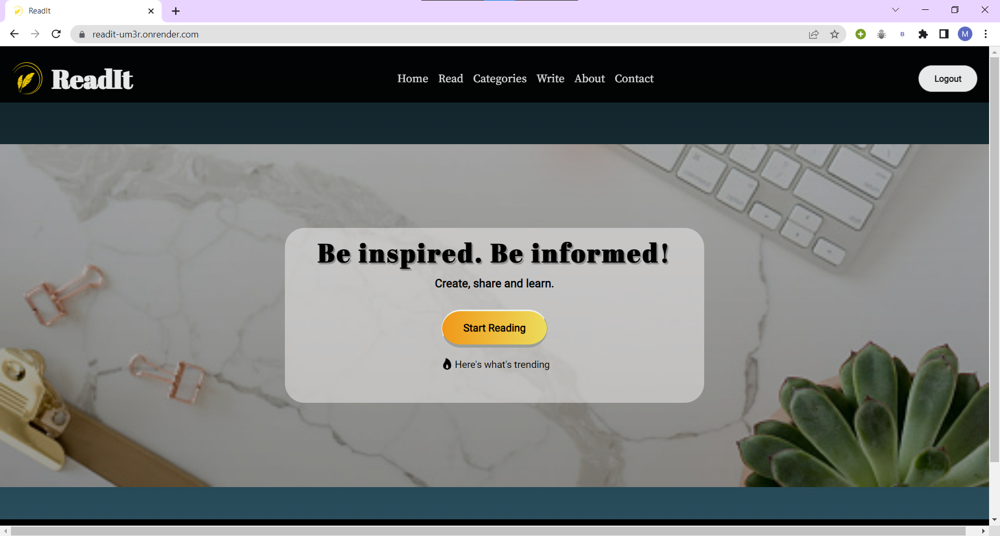
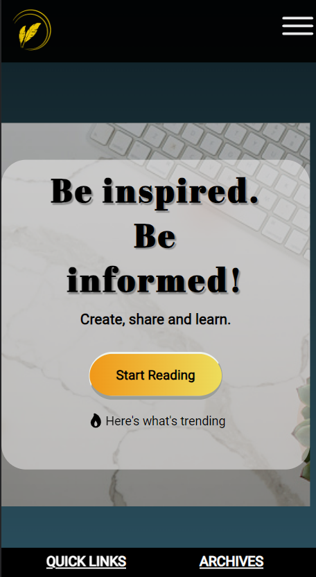
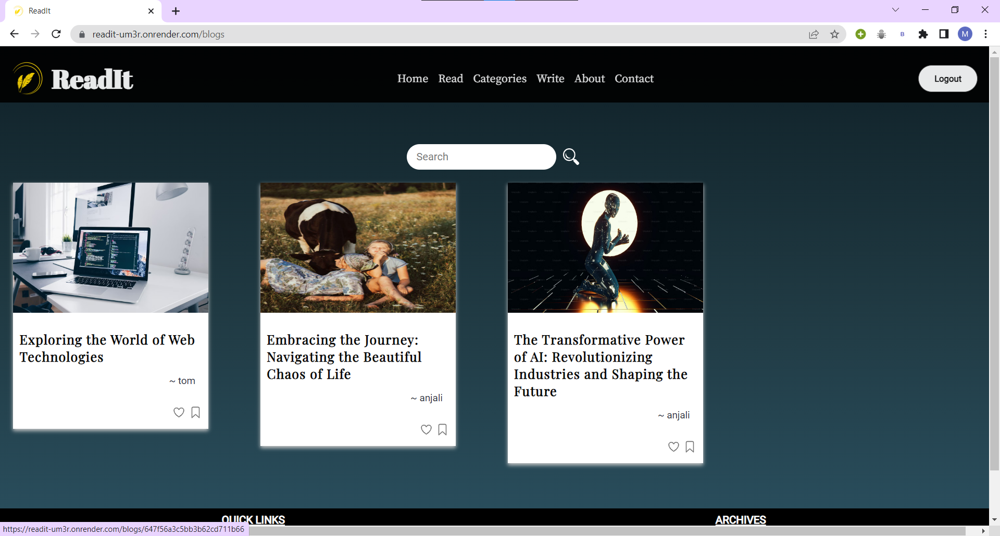

<br/>
<p align="center">
  <a href="https://github.com/mishikaa/ReadIt">
    
  </a>

  <h3 align="center">ReadIt</h3>

  <p align="center">
    A Full-Stack Blogging website.
    <br/>
    <br/>
    <a href="https://readit-um3r.onrender.com/"><strong>View Demo »</strong></a>
    <br/>
    <br/>
    .
    <a href="https://github.com/mishikaa/ReadIt/issues">Report Bug</a>
    .
    <a href="https://github.com/mishikaa/ReadIt/issues">Request Feature</a>
  </p>
</p>

 
 
 


## Table Of Contents

- [Table Of Contents](#table-of-contents)
- [About](#about-the-project)
- [Built With](#built-with)
- [Getting Started](#getting-started)
  - [Prerequisites](#prerequisites)
  - [Installation](#installation)
- [Contributing](#contributing)
  - [Creating A Pull Request](#creating-a-pull-request)
- [License](#license)
- [Authors](#authors)

## About The Project

ReadIt is a blogging platform designed to provide a platform for users to share and discover engaging content on a wide range of topics. With its 
intuitive user interface and powerful features, ReadIt aims to create a vibrant community where individuals can express their thoughts, learn from 
others, and foster meaningful discussions.

### Home Page


### Mobile View


### Read Blogs


## Built With

* [EJS](https://ejs.co/)
* [CSS](https://developer.mozilla.org/en-US/docs/Web/CSS)
* [JavaScript](https://www.javascript.com/)
* [NodeJs](https://nodejs.org/en/about)
* [ExpressJs](https://expressjs.com/)
* Database: [MongoDB](https://www.mongodb.com/)
* Authentication: [jwt](https://jwt.io/)


## Getting Started

To get a local copy up and running follow these simple example steps.

### Prerequisites

This program has no pre-requisites

### Installation

1. Clone the repo

```sh
git clone https://github.com/mishikaa/ReadIt.git
```

2. In the command prompt, enter the following commands

```sh
npm install
```
```sh
node index.js
```

3. Open your browser and run the application on [localhost:3000](http://localhost:3000/)

## Contributing

Contributions are what make the open source community such an amazing place to be learn, inspire, and create. Any contributions you make are **greatly appreciated**.
* If you have suggestions for adding or removing projects, feel free to [open an issue](https://github.com/mishikaa/ReadIt/issues/new) to discuss it, or directly create a pull request after you edit the *README.md* file with necessary changes.
* Create individual PR for each suggestion.
* Please also read through the [Code Of Conduct](https://github.com/mishikaa/ReadIt/blob/main/CODE_OF_CONDUCT.md) before posting your first idea as well.

### Creating A Pull Request

1. Fork the Project
2. Create your Feature Branch (`git checkout -b feature/FeatureName`)
3. Commit your Changes (`git commit -m 'Add some FeatureName'`)
4. Push to the Branch (`git push origin feature/FeatureName`)
5. Open a Pull Request

## License

Distributed under the MPL-2.0 License. See [LICENSE](https://github.com/mishikaa/ReadIt/blob/main/LICENSE.md) for more information.

## Authors

* **Mishika Jaiswal** - *Comp Science Student* - [Shaan Khan](https://github.com/mishikaa/) - *All Work*
